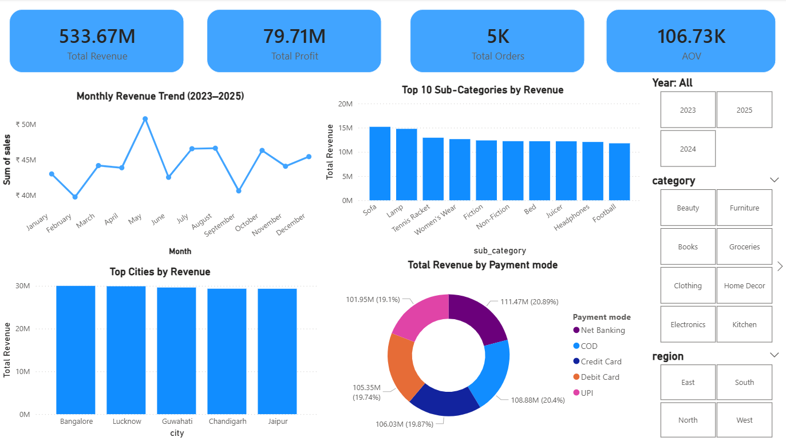

# 🛒 E-commerce Sales & Profitability Analysis (2024–2025)

## 🚀 Project Status


---

## 📌 Project Overview

This project analyzes e-commerce transactional data (2024–2025) to uncover insights related to:

* 📈 Sales Performance
* 💰 Profitability
* 📉 Discount Impact
* 🧾 Customer Behavior

📊 The project follows an **end-to-end data analytics pipeline**:

```text
CSV → MySQL → SQL Analysis → Python (EDA) → Power BI Dashboard
```

---

## 🎯 Objectives

* Analyze monthly revenue trends
* Identify top-performing categories and regions
* Evaluate profit margins and efficiency
* Understand discount impact on profitability
* Study customer purchasing behavior (AOV)

---

## 🧱 Tech Stack

| Tool                | Purpose                 |
| ------------------- | ----------------------- |
| 🐬 MySQL            | Data Storage & Querying |
| 🐍 Python           | Data Cleaning & EDA     |
| 📊 Power BI         | Dashboard Visualization |
| 📓 Jupyter Notebook | Analysis                |

---

## 📥 Data Ingestion

* Loaded CSV data into MySQL
* Created table: **sales2024_25**
* Performed:

  * Data validation
  * Duplicate checks
  * Date formatting

---

## 📊 Power BI Dashboard

### 🔹 Features:

* KPI Cards (Revenue, Profit, Orders, AOV)
* Monthly Revenue Trend
* Category & Region Analysis
* Discount vs Profit Scatter Plot
* Payment Mode Distribution
* Interactive Filters

---

### 📸 Dashboard Preview

<p align="center">
  
</p>

---

## 📊 Key Insights

### 📈 Sales Performance

* Stable revenue with seasonal peaks
* October 2025 drop due to incomplete data

---

### 💰 Profitability

* Profit margins consistent (~14–15%)
* Profit driven by **sales volume**, not efficiency

---

### 📉 Discount Impact

* Discount range: ~9.5%–10.6%
* Weak negative correlation with profit
* Minimal impact on overall profitability

---

### 🌍 Regional Analysis

* North region leads in revenue
* Balanced performance across regions

---

### 🏙 City Insights

* Revenue evenly distributed across cities
* No dependency on a single location

---

### 💳 Payment Analysis

* Uniform usage across payment methods
* No major impact on revenue/profit

---

### 🧾 Customer Behavior

* AOV: ₹106,733
* Indicates high-value transactions

---

### 🧠 Python Insights

* Profit is right-skewed
* Few high-value transactions drive profit
* Strong Sales ↔ Profit correlation (~0.85)

---

## 🏆 Conclusion

The business demonstrates:

* ✅ Stable revenue trends
* ✅ Diversified revenue streams
* ✅ Consistent pricing strategy
* ✅ Profit driven by transaction value

👉 Discounts are **not a major driver of profitability**

---

## 📌 Project Structure

```text
📂 project-folder
 ┣ 📸 dashboard.png
 ┣ 📜 README.md
 ┣ 📊 EDA.ipynb
 ┣ 📄 Ecommerce_Analysis_Report.docx
 ┣ 📊 ecommerce.pbix
 ┣ 📁 logs
 ┗ 📁 ecommerce_dataset
```

---


## 🙌 Author

**Raunak Gangwal**

---
